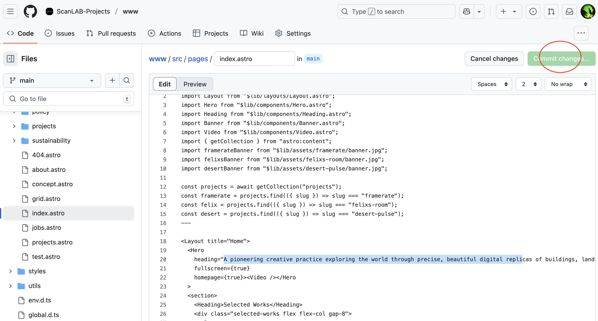

# scanlabprojects.co.uk `v5`


Getting started.

## Currently [Staging](http://cicd-staging-scanlab-www.s3-website.eu-west-2.amazonaws.com)

- Node `>20`
- Package manager `pnpm`
- Requires Git for branch deployments

```bash
pnpm install    # install locally
pnpm dev        # preview changes
pnpm sync       # push to Github, patch and deploy
```

## Deplopyments

**reccommended**
🚀 The CICD pipeline configured on Github will automatically build and sync with AWS S3 bucket.

> As the previous commit would have been applied automatically, you will need to pull and sync the repo first before pushing again. A simple `git pull` will suffice.

```bash
pnpm sync
```

🧑‍💻 Otherwise you can make changes directly on the Github repo page itself.
_...on doing so the site will build automatically_

