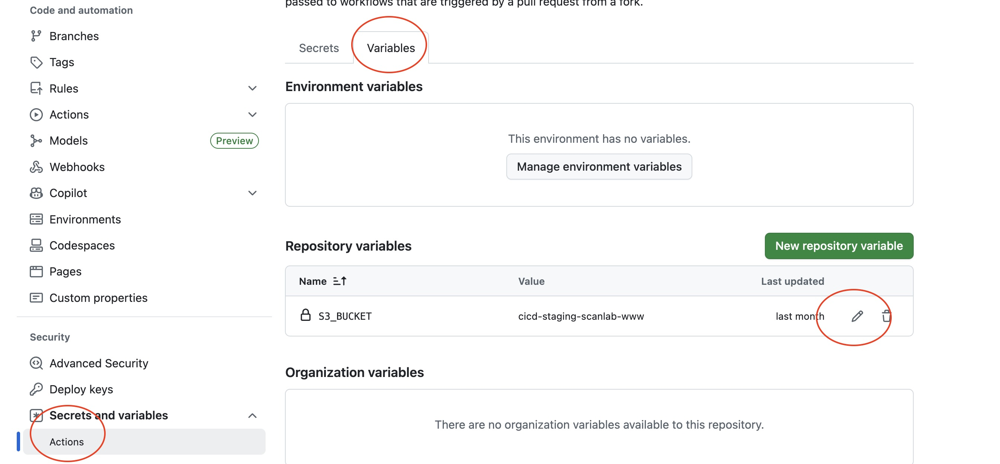
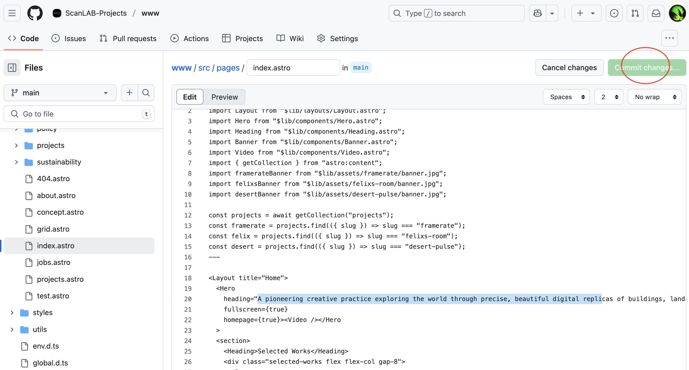
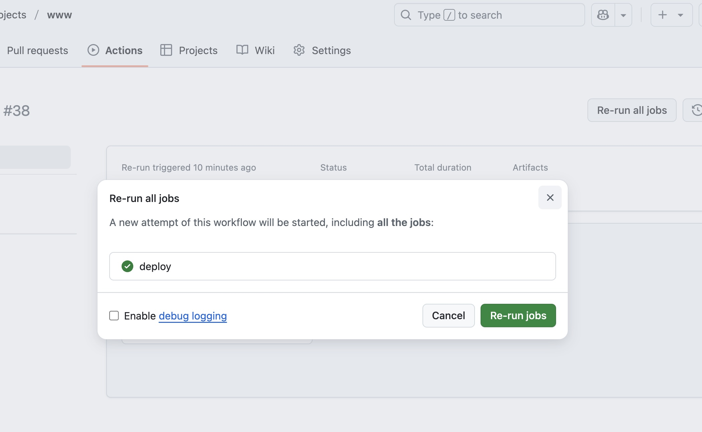

# scanlabprojects.co.uk `v5`


Getting started.

## Currently [Staging](http://cicd-staging-scanlab-www.s3-website.eu-west-2.amazonaws.com)

### Going to production


^^ Update this to the `scanlabprojects.co.uk` bucket

- Node `>20`
- Package manager `pnpm`
- Requires Git for branch deployments

```bash
pnpm install    # install locally
pnpm dev        # preview changes
pnpm sync       # push to Github, patch and deploy
```

## Deplopyments

**reccommended**
🚀 The CICD pipeline configured on Github will automatically build and sync with AWS S3 bucket.

```bash
pnpm sync
```

🧑‍💻 Otherwise you can make changes directly on the Github repo page itself.
_...on doing so the site will build automatically_


### Project Order | Filtering

By editing visibility and the order of **slug** in the `src/config/data.ts` file, projects will be respectively available in the projects list.

```js
order: [
  "desert-pulse", // position 1
  "rhythms-around-us",
  // "framerate", // hidden
  "felixs-room",
];
```

### Mobile video

- Mobile videos are aligned against the first `5` in the Project Order dataset
- name the video with matching project meta `mobile` field
- showreel is currently named `mobile-slp`
- format 2 versions `webm` and `mp4` (no need to populate above field with format)
- upload to s3 bucket: `media.scanlabprojects`
- Portrait dimensions are `720x1280`
- **static images** set with `mobile: "static.jpg"` in project meta. These images must be uploaded to repo location: `public/mobile/filename.jpg`

### Trigger a deployment for Exhibition updates

You (specific users) can make EDIT's to the spreadsheet [here](https://docs.google.com/spreadsheets/d/1iJ8XBJGkpWw33kltxKcuTd5X9-txEhHpy4Ldi9RVgdo)
Then goto [Actions](https://github.com/ScanLAB-Projects/www/actions) tab and click any previous deploy.

You have the option to re-run, do so and the new data will be reflected.


### Page CRUD

There are 2 types of pages:

1. Standard pages: `src/pages` type: `.astro`
2. Project pages: `src/content/projects` type: `.mdx`

> Creating an `.mdx` file will be creating the `slug` for the project.

Both use `HTML`, whereas specifically, the project pages are setup to consume `markdown`.

Project pages also **require** `frontmatter`, a `YAML` syntax to define higher level meta config.

```yaml
---
title: "Page title"
client: ""
heading: ["overrides the following on project pages", "client", "subtitle"]
subtitle: ["Extra project page paragraphs", "Use comma seperated for new lines"]
link: "https://external.link.com"
description: "SEO short page descriptor"
vimeo: "643973859"
mobile: "video-file-name" # "with.jpg" for static
background: "filename.jpg" # fallback used when no video is present
tags: [] # deprecated
---
```

### Images

Re Project pages, we use the `slug` as an identifier ie: `eternal-room.mdx` becomes the URL page slug `eternal-room`.
This is used to match assets and content against respectively.

Place images for `eternal-return` in the corresponding `src/assets/projects/eternal-return` location.
Images placed here will automatically be reduced during the build step.

### Markdown + MDX HTML Content

> don't forget that these components need importing (on page script) to be used - copy existing examples

**Quotes** - nb. the `center` prop (defaults to true) which will align left or centre respectively.

```html
<Quote center="{false}" cite="hello, james">
  <q>Welcome to the jungle welcome to the jungle welcome to the jungle</q>
</Quote>
```

**Whitespace** adds block whitespace as needed for custom formatting.

Available props: `sm` | `md` | `lg` | `xl` | `2xl` | `3xl`

```html
<Whitespace size="lg" />
```

### Archive

All Previous projects are publicly available under their original slug.
